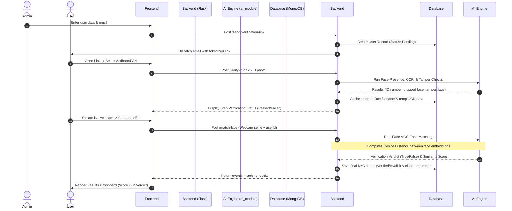

# SecureKYC: AI-Powered Biometric Identity Verification & Document Anti-Spoofing System

SecureKYC is an end-to-end, bank-grade user onboarding and identity verification platform. The system combines classical computer vision and deep learning pipelines to extract information from identity documents (Aadhaar & PAN), verify document authenticity, and perform live biometric facial matching using webcam feeds.

---

##  Key Features

*   **Secure Session Onboarding:** Administrative generation of temporary, token-signed verification links dispatched via secure SMTP.
*   **Document Face Presence Check:** Automated localization and extraction of ID photos using optimized OpenCV Haar Cascade Classifiers.
*   **Deep Learning OCR Extraction:** Extraction of cardholder names and ID numbers (PAN/Aadhaar formats) using EasyOCR, integrated with regex validation.
*   **Multi-Stage Document Tamper Detection:**
    *   **Photo Edge Check:** Applies Canny Edge Detection and Hough Line Transforms to detect suspicious margins indicative of physical photo-pasting.
    *   **Text Background Consistency Check:** Measures standard deviation (texture) and average color consistency around textual fields to identify pasted overlay strips.
*   **Biometric Live Face Matching:** Compares the extracted ID face reference against a live webcam capture using **DeepFace (VGG-Face)**, calculating similarity metrics based on **Cosine Distance**.
*   **Flexible Data Persistence:** A schemaless MongoDB database stores user data, verification statuses, OCR transcripts, and security audit scores.
*   **Dockerized Deployment:** Multi-container configuration isolating the React frontend, Python Flask API backend, and MongoDB service.

---

##  Technology Stack

*   **Frontend:** React.js, React Router DOM, React Webcam, TailwindCSS, PostCSS.
*   **Backend:** Python 3.10, Flask, Flask-CORS, PyMongo, itsdangerous (Token serialization).
*   **Database:** MongoDB v6.0.
*   **AI/Computer Vision:** OpenCV (cv2), DeepFace (VGG-Face model), EasyOCR (PyTorch-based), PyZbar (QR Code Scanning).
*   **Containerization:** Docker, Docker Compose.

---

##  Architecture & Pipeline

The verification sequence follows a strict multi-step pipeline:



### **The Mathematics of Face Matching (Cosine Similarity)**
Inside the `face_matcher.py` module, DeepFace maps both the cropped ID face ($A$) and the live photo ($B$) into 4096-dimensional vector embeddings. The similarity is evaluated using **Cosine Distance**:

$$d_{\text{cosine}}(A, B) = 1 - \frac{A \cdot B}{\|A\| \|B\|}$$

- A match is confirmed if $d_{\text{cosine}}$ is below the model threshold (default `0.40` for VGG-Face).
- The final matching score is calculated as: $\text{Score} = (1 - d_{\text{cosine}}) \times 100$.

---

##  Project Directory Structure

```text
SecureKYC/
├── ai_module/                  # Core computer vision & ML engines
│   ├── haarcascade_frontalface_default.xml   # Haar cascade xml for face detection
│   ├── face_presence.py        # OpenCV-based face detection & cropping
│   ├── ocr_extractor.py        # EasyOCR extraction and ID parsing
│   ├── tamper_detector.py      # Photo-pasting & background texture checks
│   ├── face_matcher.py         # DeepFace biometric matching using Cosine Distance
│   ├── qr_scanner.py           # QR scan and verification utility
│   └── test.py                 # Core testing pipeline script
│
├── backend/                    # Python Flask Web Service
│   ├── app.py                  # API endpoints, Mongo connection & routing
│   ├── requirements.txt        # Server dependencies (Flask, PyMongo, opencv, etc.)
│   └── Dockerfile              # Python container definition
│
├── frontend/                   # React Single Page Application
│   ├── src/                    # Components & pages (Admin, Users, Pan, Aadhaar, Result)
│   ├── package.json            # Web dependencies
│   └── Dockerfile              # Node.js dev server container definition
│
└── docker-compose.yml          # Orchestration configuration
```

---

##  Setup and Installation

### **Prerequisites**
- Docker & Docker Compose installed on your host system.
- *(Optional for manual setup)* Python 3.10+ and Node.js.

### **Method 1: Running with Docker (Recommended)**

1. Clone this repository to your local machine:
   ```bash
   git clone <your-repository-url>
   cd SecureKYC
   ```
2. Run the multi-container stack:
   ```bash
   docker-compose up --build
   ```
3. The services will bind to the following host ports:
   - **Frontend UI:** `http://localhost:3000`
   - **Backend API:** `http://localhost:5000`
   - **MongoDB:** `mongodb://localhost:27017/`

### **Method 2: Manual Local Running**

#### **1. Database Setup**
Ensure you have MongoDB running locally on port `27017`.

#### **2. Backend Setup**
1. Navigate to the backend directory:
   ```bash
   cd backend
   ```
2. Create and activate a python virtual environment:
   ```bash
   python -m venv venv
   source venv/bin/activate  # On Windows: venv\Scripts\activate
   ```
3. Install dependencies:
   ```bash
   pip install -r requirements.txt
   ```
   *Note: Ensure system libraries for OpenCV and PyZbar are installed on your host OS.*
4. Start the backend:
   ```bash
   python app.py
   ```

#### **3. Frontend Setup**
1. Navigate to the frontend directory:
   ```bash
   cd ../frontend
   ```
2. Install node dependencies:
   ```bash
   npm install
   ```
3. Start the React development server:
   ```bash
   npm start
   ```

---

##  API Reference Summary

| Endpoint | Method | Payload | Description |
| :--- | :--- | :--- | :--- |
| `/send-verification-link` | `POST` | `{ username, email, userId, dob, mobile }` | Registers pending user details in DB and emails the onboarding link. |
| `/verify-token` | `POST` | `{ token }` | Validates signed session tokens. |
| `/verify-id-card` | `POST` | `multipart/form-data` (File: `id_card_photo`, Form: `id_type`, `userId`) | Performs Face Presence, OCR, and Tamper checks; updates database session cache. |
| `/match-face` | `POST` | `multipart/form-data` (File: `live_photo`, Form: `userId`) | Validates live selfie against document photo using VGG-Face; updates final user status. |
| `/get-verified-users` | `GET` | None | Fetches all recorded user KYC statuses for the Admin dashboard. |
| `/delete-user/<user_id>` | `DELETE`| None | Permanently removes user records from database. |

---

##  License
This project is licensed under the MIT License - see the [LICENSE](LICENSE) file for details.
